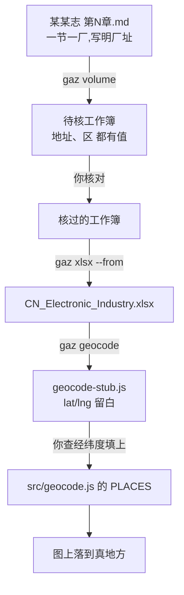

# 有厂址的章:从建档到落点

> [!info] 这一份与《地方志建档流程》的分别
> 《流程》管的是**共通的**那几步:转换、抽取、核对、并表。
> 这一份只讲**多出来的那一步 —— 落点**,以及有厂址的章在核对时该多看什么。
> 两份都要用:先照《流程》走完前四步,再回到这里做落点。



---

## 先认一认:这一章给不给厂址

一节一厂、每节开头写着「厂址在……」的,才是这一类。抽完看一眼就知道:

```powershell
cd D:\Coding\CN_Map
python tools\gazetteer\gaz.py volume 第二章 --city Shanghai
```

(稿子要先挪进 `D:\Coding\CN_Map\转换稿` —— 见《地方志建档流程》第一步。
关键词写几截都行,不必加引号;城市写 `--city Shanghai`,不是 `-- Shanghai`。)

报「**N 家有专条**」而且数目可观,就对了。《北京工业志·电子志》**第四篇
企业**是正例:120 家单位,61 家有专条,48 家写着厂址。同一本志的**第三章**
是反例:按机型分节,91 家单位只有 2 家沾着地址 —— 那种章别指望落点。

> [!tip] 北京的地址写法与上海不一样
> 上海是「路、弄」,北京是「胡同、N条、甲N号」——「德胜门外塔院胡同8号」
> 「朝阳门外二条67号」「古城北路甲4号」都认得。志书只写到「朝阳区深沟村」
> 这一步的,就录到这一步,不替它补门牌。

> [!tip] `--min-mentions` 用默认的 2 就好
> 一节一厂的章,厂名在自己那一节里反复出现,专条那一条已经把关。
> 只有按机型分节、单位是顺带点到的章(如北京第三章),才需要放到 1。

---

## 核对时多看两栏

照《流程》核「待核」表,另外多盯两栏:

| 栏 | 看什么 |
| --- | --- |
| **地址** | 只抄志书写的门牌。志书没写就**空着** —— 不从别处补 |
| **区** | 落点表要用。抽错了当场改;志书没写就空着 |

> [!important] 地址只从志书来
> 这一栏是史料,不是查出来的。志书写「厂址在闸北区中华新路688号」,就记
> 「中华新路688号」,区记「闸北」。志书没写,这一栏就空着 —— 空着是实情,
> 从别处填上就成了另一回事。

抽错过的样子(现在挡住了,还是留神):产品名混进地址栏。
「自动导航专用的集成电路」里的「电路」以「路」收尾,一度被当成马路。

---

## 落点:多出来的那一步

并进工作簿之后做。**坐标不是志书里的东西**,得你来定。

### 一、开草稿

```powershell
cd D:\Coding\CN_Map
Get-ChildItem gaz-work | Select-Object Name        # 先看这本志的代号叫什么
python tools\gazetteer\gaz.py geocode --slug "上海某某志 第二章"
```

它把**尚未在 PLACES 里**的单位列出来,写成
`gaz-work\<代号>\review\geocode-stub.js`:

```js
  "上海元件十四厂": { lat: null, lng: null, district: "闸北", precision: "city",
                     note: "中华新路688号、上海某某志·第二章·第一节 上海元件十四厂" },
```

门牌与出处已经摆在 `note` 里 —— 查坐标时照着它查,不必再翻书。
`--all` 可以连没写 `y` 的一并列出。

### 二、填坐标

一家一家查,把 `lat` / `lng` 填上,并把 `precision` 改准:

| precision | 什么意思 | 什么时候用 |
| --- | --- | --- |
| `street` | 落到街段 | 门牌查得到具体位置 |
| `district` | 落到区 | 只知道在哪个区 |
| `city` | 落到市中心 | 什么都不知道 —— **留着 lat/lng 为 null 即可** |

> [!important] 地址是史料,坐标是推定
> 两者不同,别混作一谈。地址只抄志书;**坐标本来就不在志书里** —— 它是照
> 志书写明的门牌推出来的近似值。所以:
> - 志书写了门牌 → 照门牌定坐标,`precision: "street"`,`note` 里留着门牌。
> - 志书只写了区 → `precision: "district"`。
> - 志书什么也没写 → **不要去别处找地址来凑**。lat/lng 留 null,
>   图上落在市中心并标明「城市级」,那是老实话。
>
> 老路名要留一笔:`note: "原福煦路,今延安中路"`。查的是今名,记的是原名。

### 三、粘进去

把填好的几行粘进 `src/geocode.js` 的 `PLACES`(照字母序或成组放都行),
再看一眼有没有落下的:

```powershell
cd D:\Coding\CN_Map
python tools\gazetteer\gaz.py geocode --slug "上海某某志 第二章"
```

再跑一遍,该报「没有需要新增落点的单位」。

---

## 验一验:还有几家没落点

```powershell
cd D:\Coding\CN_Map
node --input-type=module -e "import fs from 'fs';import {parseWorkbook} from './src/xlsxio.js';const d=parseWorkbook(fs.readFileSync('CN_Electronic_Industry.xlsx'));const v=d.units.filter(u=>u.precision==='city');console.log('城市级(尚无落点)：'+v.length+' / '+d.units.length);v.slice(0,20).forEach(u=>console.log('   '+u.name));"
```

> [!note] 落在市中心不是错,是没查到
> 图上会标「城市级」,不冒充精确。查到一家填一家,不必一次填完。

---

## 每章一份清单

- [ ] 照《地方志建档流程》走完:更新、关 Excel、`gaz volume`、核对、`gaz xlsx --from`、`gaz dups`
- [ ] 核对时多盯**地址**与**区**两栏;志书没写的空着,不从别处补
- [ ] `gaz geocode --slug "<代号>"` 开落点草稿
- [ ] 照 `note` 里的门牌查坐标,填 `lat`/`lng`,改准 `precision`
- [ ] 老路名记进 `note`
- [ ] 粘进 `src/geocode.js` 的 `PLACES`
- [ ] 再跑一遍 `gaz geocode`,该报「没有需要新增落点的单位」
- [ ] 验一验还剩几家城市级
- [ ] `git commit`(工作簿与 `geocode.js` 一并提交)
