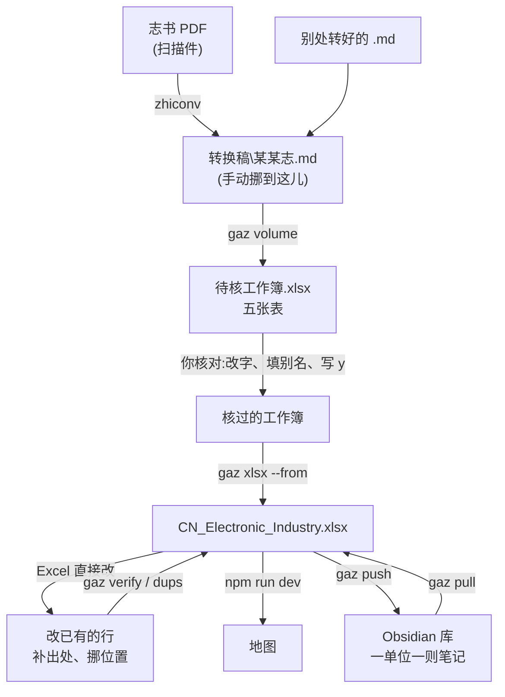

# 地方志 → 地图:建档与核对

> [!info] 一句话
> 志书转成 Markdown → 抽成一份**待核工作簿** → **你逐条核对** → 并进
> `CN_Electronic_Industry.xlsx` → 地图上就有了。
> 誊录的活儿归工具,判断的活儿归你:没写 `y` 的行,一行也进不了工作簿。
> 已经在总表里的行要改(补出处、挪位置),不走这一路 ——
> 见《[[#改已有的行:补出处、挪位置、改字]]》。

> [!tip] 志书写明厂址的章,另有一份
> 一节一厂、写着「厂址在……」的章,并表之后还得**落点**(查经纬度、填进
> `src/geocode.js`)。那一步单写在《[[电子工业地图流程]]》里,与这一份配着用。

> [!note] 底下每一段命令,都当作**刚开一个新终端**写
> 所以每段都从 `cd D:\Coding\CN_Map` 起头 —— 命令在仓库里(`D:\Coding\CN_Map`),
> 稿子在库里(`D:\Archive`),两处别弄混。上一段设的 `$md` 一类变量,这一段
> 一概不作数。
> `GAZ_DRAFTS`、`GAZ_VAULT` 是另一回事:存在系统里,新开终端照样认,不必重设。

> [!danger] 每次动手之前:先更新,再关掉 Excel
> ```powershell
> cd D:\Coding\CN_Map
> git pull origin claude/local-gazetteer-ocr-md-extract-po9dtk
> ```
> 拿旧版跑不会报错,只是**少一道关卡而已,而少了的那道不会吭声** ——
> 判重是后加的,旧版追加时一条也不比,同一批整机能原样再进一遍。
> `gaz dups`、`gaz guide` 认不出来,就是该更新了。
>
> Excel 开着会锁住文件。锁着不至于白干(会另存成 `…-新.xlsx`),但你会多一个文件。



---

## 〇、一次性设置(装机时办一遍,以后不必再管)

```powershell
git config --global user.name  "你的名字"          # 不设,git commit 会拒绝
git config --global user.email "你的邮箱"
[Environment]::SetEnvironmentVariable("GAZ_DRAFTS", "D:\Coding\CN_Map\转换稿", "User")
[Environment]::SetEnvironmentVariable("GAZ_VAULT",  "D:\Archive\厂所",   "User")
```

设完**新开一个终端** —— 环境变量只有新起的程序看得见。

---

## 一、把志书变成 Markdown,放进 `D:\Coding\CN_Map\转换稿`

手里已经是 `.md` 就跳过转换,但**那一步搬家还是要办**。

```powershell
cd D:\Coding\CN_Map
python tools\gazetteer\gaz.py convert 某某志.pdf --first 250 --last 320
```

> [!important] 转好的篇章,手动挪到 `D:\Coding\CN_Map\转换稿`
> 往下每一步都从这里找稿子(`GAZ_DRAFTS` 指的就是它)。**放在别处,
> `gaz volume` 找不到** —— 它只在这一个目录底下走,不会满盘去搜。
> 目录不存在就先建一个;稿子直接摊在里头即可,不必再分子目录。
>
> 文件名照《书名》体例写,如 `《北京工业志·电子志》2001 第四篇.md` ——
> 书名从《》里取,`gaz volume 第四篇` 认的也是文件名里的那一截。
> 字形订正表跟稿子摆在一处(`某某志.fixes.tsv`),会自己配上。

> [!warning] 转换稿在仓库里,`git add -A` 会把它们一并提交
> 想连稿子一起入库(来源可查)就照旧;不想的话,先办一遍:
> ```powershell
> cd D:\Coding\CN_Map
> Add-Content .gitignore "`n转换稿/"
> ```
> 待核工作簿(`转换稿\某某志.xlsx`)是过程稿,一并被这一行挡在外头 ——
> 它本来也不必入库,核对的成果最终落在 `CN_Electronic_Industry.xlsx` 里。

> [!tip] 一本志几百页,要一章就别转另外二十九章
> `--first/--last` 只转其中一段。转换本身交给 zhiconv(在
> Historian_Archive_Management 里),识别引擎另装,`gaz check` 会告诉你缺什么。

---

## 二、抽成待核工作簿

**每本志一条命令**,按稿子名里的一截找:

```powershell
cd D:\Coding\CN_Map
python tools\gazetteer\gaz.py volume 第三章 --city Beijing --min-mentions 1
```

它自己去 `GAZ_DRAFTS`(`D:\Coding\CN_Map\转换稿`)底下找名字里带「第三章」
的 `.md`,连同旁边的 `*.fixes.tsv` 一并配好。重名的会把找到的都列出来,叫你
说准一点;一份也没有的直接说没有 —— 不会拿错一份稿子闷头跑。

> [!tip] 关键词写几截都行,不必加引号
> `gaz volume 《北京工业志·电子志》2001 第四篇 --city Beijing` ——
> 几截都在文件名里才算这一份。**城市要写成 `--city Beijing`**,
> 光写 `-- Beijing` 是不作数的(那会被当成又一截关键词)。

工作簿落在 `.md` 旁边,同名。指名道姓地跑某一份就用 `gaz book <路径>`。

> [!warning] 先关掉 Excel
> Excel 开着就锁住文件。锁着也不至于白干 —— 会另存成 `…-新.xlsx` 并告诉你,
> 但你会多出一个文件。

### 五张表,四张读得回来

| 表 | 装什么 | 改了算不算数 |
| --- | --- | --- |
| **待核** | 厂所。核名字、改字都在这儿 | ✅ |
| **Comp-Product** | 计算机整机 | ✅ |
| **Semi-Product** | 半导体器件 | ✅ |
| **Name-History** | 名称沿革(有年份的改名) | ✅ |
| Fact and Comp-<城> | 照原表体例排的预览 | ❌ 改这里不算数 |

---

## 三、核对 —— 只有人能干的活

打开工作簿,从**待核**表进。前几列就是判断所需的一切:

`取否 | 单位 | 别名 | 置信 | 出处 | 据以立论的原文`

> [!important] 核对是改字,不只是打勾
> 「取否」只管收不收;**格子里的字才是要写进工作簿的那一份**。名字认错的
> 当场改,行业空着的填上,志书写了而没抽出来的年份补上,整行都可以自己添。

### 做法

- [ ] **不要的行直接删掉** —— 整行删、或选中按 Delete 都行
- [ ] 剩下的**整列填 `y`**(比逐行打勾快得多)
- [ ] 名字认错的当场改
- [ ] 同一家的几个名字:留一个当正名,其余填进「别名」,用「、」隔开
- [ ] 另外三张表也各有「取否」在 A 列,别漏了

> [!note] 删了不等于没了
> 全部候选(含删掉的)另存了一份在
> `gaz-work\<某某志>\review\units.tsv`,带原文与出处。要找回来随时找得回来。
> 但这份 TSV 每次跑 `book` 都会重写 —— 想留住某一次,先把文件夹拷走。

### 别名 ≠ 后改名

| 情形 | 放哪儿 | 图上怎么显示 |
| --- | --- | --- |
| 同时并行的另一个名号<br/>(四机部15所、亦称DJS-1) | **别名**列 | 正名旁边一并列出,搜哪个都搜得到 |
| 改过名,年份可考<br/>(1982年随部委改制) | **Name-History**表 | 按年份显示:拉到1980年是旧名,拉到1990年是新名 |

### 日期怎么写都行

`1958`、`195803`、`1958年3月`、`民国二十六年`,连 Excel 存成的日期格,
读回来都会归成八位整数(`19580000` = 只知道年份)。认不出的原样留着,
不替你猜 ——「待查」就还是「待查」。

---

## 四、并进工作簿

```powershell
cd D:\Coding\CN_Map
python tools\gazetteer\gaz.py xlsx --from "D:\Coding\CN_Map\转换稿\某某志.xlsx"
```

> [!check] 看一眼分母
> 它会报「103/103 家单位」。**103/103 说明一行没挑** —— 核名字本是要挑的。
> 12/103 才是核过的样子。

> [!check] 重复的会自己跳过
> **单位**连别名一起比 ——「四机部15所」送进来,表里已有「华北计算技术研究所」
> 且别名里写着它,就认得出是同一家,不会收成两家。
> **器件、整机、沿革**按整条比(产品+厂+年份 / 产品+年份 / 单位+名称+启用年)。
> 所以同一本志跑两遍,第二遍一条也不会多出来。
> 确要重复登记,加 `--allow-dup`。

写之前先备份;写不进就是 Excel 还开着,原表不动。

### 推之前查一遍重复

```powershell
cd D:\Coding\CN_Map
python tools\gazetteer\gaz.py dups
```

分两等报:**一模一样**的多半是追加了两遍,删掉即可;**像是一回事**的得你
自己看 ——「DJS-130」与「DJS-130B」型号内核一样,却是两台机器。它只报,
一个格子也不动。

```powershell
cd D:\Coding\CN_Map
git add -A
git commit -m "补录 某某志"
git push
```

> [!tip] 追错了,退回来不费事
> ```powershell
> cd D:\Coding\CN_Map
> git checkout -- CN_Electronic_Industry.xlsx
> ```
> 回到上次提交的样子,重追一遍即可。**核对的成果不在总表里,在待核工作簿里**,
> 所以退回不损失任何工夫。删行改字都不必 —— 退回重来比在总表里收拾干净。
> (它每次追加前也会自己存一份 `CN_Electronic_Industry.backup-*.xlsx`;
> 用不着的删掉就是。)

---

## 五、看图 / 进 Obsidian

> [!warning] 改了工作簿,图不会自己变
> 工作簿是**构建时编译进产物**的(`import B64 from "../CN_Electronic_Industry.xlsx?b64"`),
> 不是运行时去读的文件。所以:
> - 本地看:改完**重启** `npm run dev`,光刷新页面没用。
> - 线上看:GitHub Pages 只在 **main** 有新提交时才重建。在分支上推多少次,
>   线上那张图都不会动 —— 要合进 main 才行。

```powershell
cd D:\Coding\CN_Map
npm run dev                                      # 本地看图(改了工作簿要重启)
python tools\gazetteer\gaz.py push              # 工作簿 → 笔记
python tools\gazetteer\gaz.py pull --dry-run    # 先看清单
python tools\gazetteer\gaz.py pull              # 笔记 → 工作簿,写回原行
```

`push` 把工作簿里全部厂所各写一则笔记,字段摆在 frontmatter;在 Obsidian
里改完,`pull` 写回原行(先 `--dry-run` 看清单)。

> [!warning] `--vault` 指的是一个文件夹,不是库根
> 每家厂所在那个文件夹里各成一个 `.md`,外加一则 `_厂所索引.md`。所以要指
> **库里的一个子文件夹**(如 `厂所`),不然一百来则笔记全摊在库根上,跟
> 别的笔记混作一堆。文件夹不存在会自己建。
>
> 设一次,以后 `push`/`pull`/`guide` 都不必再写 `--vault`:
> ```powershell
> [Environment]::SetEnvironmentVariable("GAZ_VAULT", "D:\Archive\厂所", "User")
> ```
> 环境变量要**新开一个终端**才生效(已开着的那个是它设之前起的,看不见)。
> 想当场就用,再补一句 `$env:GAZ_VAULT = "D:\Archive\厂所"`。
> 找库在哪儿:含有 `.obsidian` 的那个文件夹就是。
>
> 与 Historian_Archive_Management 同用一个库正合适:`items/` 归它,`厂所/`
> 归这边,两不相扰,Obsidian 的反向链接却把两边连得上。

---

## 改已有的行:补出处、挪位置、改字

不必另做一张表 —— **`CN_Electronic_Industry.xlsx` 就是那张本地 Excel**。
它在仓库里,拿 Excel 直接改,改完提交推上去即可。核对待核工作簿是给
**新收的**用的;已经在总表里的行,直接改这一份。

| 想改什么 | 改哪儿 |
|---|---|
| 补出处 | 厂所表 `Source` 列 —— 写到页(`北京工业志·电子志·2001·第三章·页112`) |
| 改地址 | `Add.` 列。**只抄志书上的原文**,志书没写就空着 |
| 挪位置 | 加 `Lat`、`Lng` 两列,填十进制度。填了就以你填的为准 |
| 添别名 | `别名` 列,顿号隔开,几个都行 |
| 记改名 | `Name-History` 表:单位 + 新名 + 启用年。**别名 ≠ 后改名** |
| 补产量 | 器件/整机表 `产量` 列 |
| 删掉不要的行 | 整行删掉即可 —— 没有别处引着它 |

> [!warning] `Lat`/`Lng` 一填,那个点就成了断言
> 不填时,落点是**推**出来的:有街巷认街巷,认不出退到区,再认不出退到
> 市中心 —— 站上标着「大致位置」,看图的人知道那是推的。一填,它就变成
> `precision: given`,标注随之消失,再没人看得出这是你查证过的,还是随手
> 填的。**查证过的才填。**
>
> 同理:在图上按「导出 Excel」拿到的那一份,`Lat`/`Lng` 里只有你自己写下
> 的坐标;推出来的另放在 `推定纬度`/`推定经度` 两列,`落点` 列写着是按街、
> 按区还是按市推的。想把某个推定坐标扶正,把它抄到 `Lat`/`Lng` 去 ——
> 那一抄就是你在担保它。

### 改完验一验

```powershell
cd D:\Coding\CN_Map
python tools\gazetteer\gaz.py verify
python tools\gazetteer\gaz.py dups
```

`verify` 只报,一个格子也不动,分四类:

- **名录** —— 整机、器件里点到的研制单位/生产厂,厂所表里查无此人。
  多半是打错字、把动词粘进了名字(「上无十三接产」),或者这一家本来
  就没登记。**连不上的那条线,图上什么也看不出来** —— 这一类最值得先看。
- **日期** —— 写成 `1958` 而不是 `19580000`。只知道年份,月日拿零补足。
- **坐标** —— 只填了一半,或者填反了落到中国境外。
- **出处** —— 空着的将来没法回查。

```powershell
cd D:\Coding\CN_Map
git add -A
git commit -m "补出处若干"
git push
```

> [!tip] 改坏了照样退得回来
> ```powershell
> cd D:\Coding\CN_Map
> git checkout -- CN_Electronic_Industry.xlsx
> ```
> 回到上次提交的样子。所以**改之前先把上一版提交掉**,退路才在。

---

## 判断的分寸:两头是反着来的

> [!abstract] 产品**宁滥勿缺**,单位**宁缺勿滥**
> **产品**漏掉一台就永远没有了,多认一个错的,核对时一眼划掉 —— 所以型号
> 按字面认,没人说谁造的也照样登记(备注写「研制单位未详」)。代价是
> 「U-2型」这样的东西会混进来。
>
> **单位**认错了会在图上落一个不存在的厂,还牵出假的沿革与协作连线 ——
> 比漏掉一家坏得多。所以分不清的宁可丢掉。

其他几条:

- **用户不是研制方。**「某所承接某厂的过程控制系统」——那家厂是机器的去处,
  记进整机的「用户」列,不算共同研制,不画协作连线。
- **产量**:整机论台、器件论只。动词必须在数字前头,所以「全机共用800多只
  电子管」不算产量。
- **出处**:有页码写页码,没页码退到篇章节
  (`北京工业志·电子志·第三章 电子计算机·第一节…`),总查得回去。

---

## 常见的坎

> [!bug] 认错的字
> 转换稿总有认错的字(「安徽无线电厂」成了「安做无线电厂」)。一本书一张
> 订正表,`错<TAB>对` 一行一条,`--fixes` 指给它。改在正文上,所以原文、
> 名称沿革里也一并是对的;只在「待核」那一格里改,就只有那一格对。

> [!bug] PowerShell 关掉又开,`$md` 一类变量就没了
> 所以别再拿变量传路径 —— `gaz volume 第三章` 自己去 `GAZ_DRAFTS` 底下找,
> 没有变量可丢。环境变量是存在系统里的,关了终端也还在。

> [!bug] `gaz` 不是命令
> 要写全 `python tools\gazetteer\gaz.py`。工具打印下一步时会照你实际的
> 敲法写,照抄即可。

> [!bug] 文件名里的「·」敲不出来
> 那就别敲。`gaz volume 第三章` 只要名字里的一截,「·」用不着碰;
> 全路径是它自己从盘上取的。

---

## 每本志一份清单

- [ ] **`git pull`** —— 别拿旧版跑
- [ ] 关掉 Excel
- [ ] 转成 Markdown(或确认已有)
- [ ] `gaz inspect` 看一眼:标题层级、有没有页码、套语
- [ ] 建订正表,把认错的字记上
- [ ] `gaz volume <关键词> --city X` 抽出待核工作簿
- [ ] 核**待核**表:删、改、填别名、写 `y`
- [ ] 核 **Comp-Product / Semi-Product / Name-History**
- [ ] `gaz xlsx --from` 并进工作簿,**看分母**
- [ ] `gaz dups` 查重复;并掉的名字填进「别名」
- [ ] `git commit` 留下修订史(**没设 user.name 会拒绝提交**)
- [ ] **重启** `npm run dev` 看图上对不对 —— 工作簿是编译进去的,不重启看不见
- [ ] 要上线得**合进 main**:GitHub Pages 只认 main,分支推多少次都不会更新
- [ ] `gaz push --vault` 推进库里
