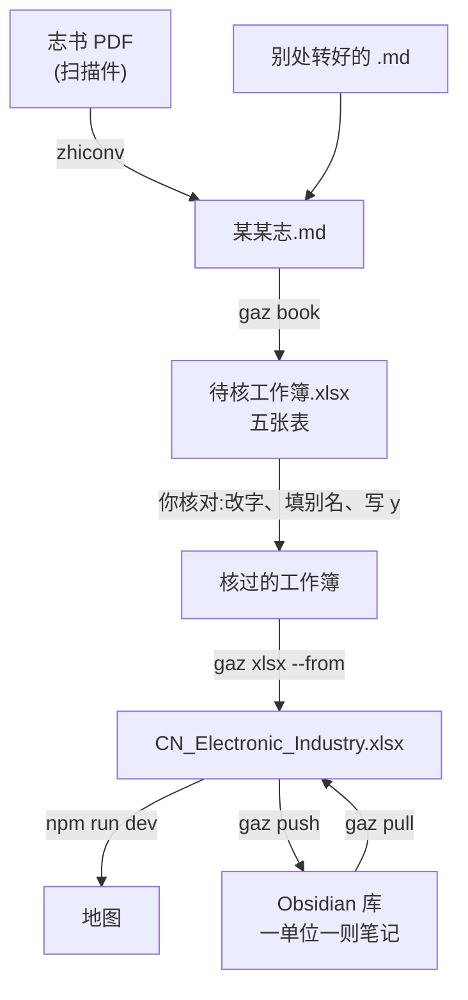

# 地方志 → 地图:建档与核对

> [!info] 一句话
> 志书转成 Markdown → 抽成一份**待核工作簿** → **你逐条核对** → 并进
> `CN_Electronic_Industry.xlsx` → 地图上就有了。
> 誊录的活儿归工具,判断的活儿归你:没写 `y` 的行,一行也进不了工作簿。



---

## 一、把志书变成 Markdown

手里已经是 `.md` 就跳过这一步。

```powershell
python tools\gazetteer\gaz.py convert 某某志.pdf --first 250 --last 320
```

> [!tip] 一本志几百页,要一章就别转另外二十九章
> `--first/--last` 只转其中一段。转换本身交给 zhiconv(在
> Historian_Archive_Management 里),识别引擎另装,`gaz check` 会告诉你缺什么。

---

## 二、抽成待核工作簿

```powershell
$md = (Get-ChildItem "D:\Archive\转换稿\地方志\*第三章.md").FullName
$fx = (Get-ChildItem "D:\Archive\转换稿\地方志\*.fixes.tsv").FullName
python tools\gazetteer\gaz.py book $md --city Beijing --min-mentions 1 --fixes $fx
```

工作簿落在 `.md` 旁边,同名。

> [!warning] 先关掉 Excel
> Excel 开着就锁住文件。锁着也不至于白干 —— 会另存成 `…-新.xlsx` 并告诉你,
> 但你会多出一个文件。

### 五张表,四张读得回来

| 表 | 装什么 | 改了算不算数 |
| --- | --- | --- |
| **待核** | 厂所。核名字、改字都在这儿 | ✅ |
| **Comp-Product** | 计算机整机 | ✅ |
| **Semi-Product** | 半导体器件 | ✅ |
| **Name-History** | 名称沿革(有年份的改名) | ✅ |
| Fact and Comp-<城> | 照原表体例排的预览 | ❌ 改这里不算数 |

---

## 三、核对 —— 只有人能干的活

打开工作簿,从**待核**表进。前几列就是判断所需的一切:

`取否 | 单位 | 别名 | 置信 | 出处 | 据以立论的原文`

> [!important] 核对是改字,不只是打勾
> 「取否」只管收不收;**格子里的字才是要写进工作簿的那一份**。名字认错的
> 当场改,行业空着的填上,志书写了而没抽出来的年份补上,整行都可以自己添。

### 做法

- [ ] **不要的行直接删掉** —— 整行删、或选中按 Delete 都行
- [ ] 剩下的**整列填 `y`**(比逐行打勾快得多)
- [ ] 名字认错的当场改
- [ ] 同一家的几个名字:留一个当正名,其余填进「别名」,用「、」隔开
- [ ] 另外三张表也各有「取否」在 A 列,别漏了

> [!note] 删了不等于没了
> 全部候选(含删掉的)另存了一份在
> `gaz-work\<某某志>\review\units.tsv`,带原文与出处。要找回来随时找得回来。
> 但这份 TSV 每次跑 `book` 都会重写 —— 想留住某一次,先把文件夹拷走。

### 别名 ≠ 后改名

| 情形 | 放哪儿 | 图上怎么显示 |
| --- | --- | --- |
| 同时并行的另一个名号<br/>(四机部15所、亦称DJS-1) | **别名**列 | 正名旁边一并列出,搜哪个都搜得到 |
| 改过名,年份可考<br/>(1982年随部委改制) | **Name-History**表 | 按年份显示:拉到1980年是旧名,拉到1990年是新名 |

### 日期怎么写都行

`1958`、`195803`、`1958年3月`、`民国二十六年`,连 Excel 存成的日期格,
读回来都会归成八位整数(`19580000` = 只知道年份)。认不出的原样留着,
不替你猜 ——「待查」就还是「待查」。

---

## 四、并进工作簿

```powershell
python tools\gazetteer\gaz.py xlsx --from "D:\Archive\转换稿\地方志\某某志.xlsx"
```

> [!check] 看一眼分母
> 它会报「103/103 家单位」。**103/103 说明一行没挑** —— 核名字本是要挑的。
> 12/103 才是核过的样子。

> [!check] 重复的会自己跳过
> **单位**连别名一起比 ——「四机部15所」送进来,表里已有「华北计算技术研究所」
> 且别名里写着它,就认得出是同一家,不会收成两家。
> **器件、整机、沿革**按整条比(产品+厂+年份 / 产品+年份 / 单位+名称+启用年)。
> 所以同一本志跑两遍,第二遍一条也不会多出来。
> 确要重复登记,加 `--allow-dup`。

写之前先备份;写不进就是 Excel 还开着,原表不动。

```powershell
git add -A
git commit -m "补录 某某志"
git push
```

---

## 五、看图 / 进 Obsidian

```powershell
npm run dev                                        # 本地看图
python tools\gazetteer\gaz.py push --vault D:\库\地图   # 工作簿 → 笔记
python tools\gazetteer\gaz.py pull --vault D:\库\地图   # 笔记 → 工作簿
```

`push` 把工作簿里全部厂所各写一则笔记,字段摆在 frontmatter;在 Obsidian
里改完,`pull` 写回原行(先 `--dry-run` 看清单)。

---

## 判断的分寸:两头是反着来的

> [!abstract] 产品**宁滥勿缺**,单位**宁缺勿滥**
> **产品**漏掉一台就永远没有了,多认一个错的,核对时一眼划掉 —— 所以型号
> 按字面认,没人说谁造的也照样登记(备注写「研制单位未详」)。代价是
> 「U-2型」这样的东西会混进来。
>
> **单位**认错了会在图上落一个不存在的厂,还牵出假的沿革与协作连线 ——
> 比漏掉一家坏得多。所以分不清的宁可丢掉。

其他几条:

- **用户不是研制方。**「某所承接某厂的过程控制系统」——那家厂是机器的去处,
  记进整机的「用户」列,不算共同研制,不画协作连线。
- **产量**:整机论台、器件论只。动词必须在数字前头,所以「全机共用800多只
  电子管」不算产量。
- **出处**:有页码写页码,没页码退到篇章节
  (`北京工业志·电子志·第三章 电子计算机·第一节…`),总查得回去。

---

## 常见的坎

> [!bug] 认错的字
> 转换稿总有认错的字(「安徽无线电厂」成了「安做无线电厂」)。一本书一张
> 订正表,`错<TAB>对` 一行一条,`--fixes` 指给它。改在正文上,所以原文、
> 名称沿革里也一并是对的;只在「待核」那一格里改,就只有那一格对。

> [!bug] PowerShell 关掉又开,变量就没了
> `$md`、`$fx` 是这一次会话的。存成 `run-某某志.ps1`,以后 `.\run-某某志.ps1`。

> [!bug] `gaz` 不是命令
> 要写全 `python tools\gazetteer\gaz.py`。工具打印下一步时会照你实际的
> 敲法写,照抄即可。

> [!bug] 文件名里的「·」
> 敲不出来就别敲:`(Get-ChildItem "…\*第三章.md").FullName` 从盘上取。

---

## 每本志一份清单

- [ ] 转成 Markdown(或确认已有)
- [ ] `gaz inspect` 看一眼:标题层级、有没有页码、套语
- [ ] 建订正表,把认错的字记上
- [ ] `gaz book` 抽出待核工作簿
- [ ] 核**待核**表:删、改、填别名、写 `y`
- [ ] 核 **Comp-Product / Semi-Product / Name-History**
- [ ] `gaz xlsx --from` 并进工作簿,**看分母**
- [ ] `npm run dev` 看图上对不对
- [ ] `git commit` 留下修订史
- [ ] `gaz push --vault` 推进库里
