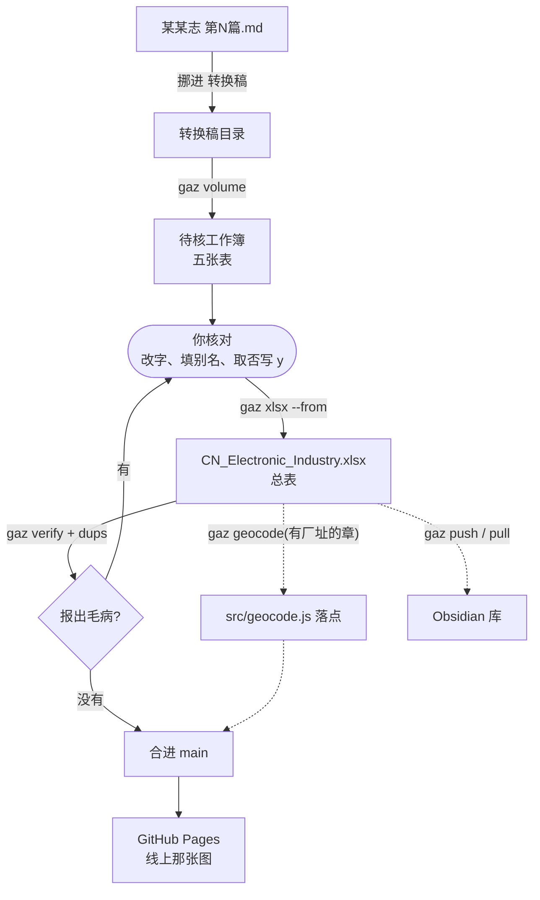

# 电子工业地图流程:从一份 .md 到地图更新

> [!info] 一句话
> 稿子放进 `转换稿` → **抽**成一份待核工作簿 → **你逐条核对** → **并**进
> `CN_Electronic_Industry.xlsx` → **验** → (有厂址的章再**落点**) →
> **合进 main**,线上那张图才会变。
> 誊录的活儿归工具,判断的活儿归你:没写 `y` 的行,一行也进不了总表。



> [!note] 底下每一段命令,都当作**刚开一个新终端**写
> 所以每段都从 `cd D:\Coding\CN_Map` 起头 —— 命令在仓库里(`D:\Coding\CN_Map`),
> 笔记在库里(`D:\Archive`),两处别弄混。上一段设的 `$md` 一类变量,这一段
> 一概不作数。`GAZ_DRAFTS`、`GAZ_VAULT` 是另一回事:存在系统里,新开终端照样认。

> [!danger] 每次动手之前:关掉 Excel,再更新
> Excel 开着会锁住文件。锁着不至于白干(会另存成 `…-新.xlsx`),但你会多一个文件。
> 更新那一套见下面《更新工具》—— **拿旧版跑不会报错,只是少一道关卡,
> 而少了的那道不会吭声**。

---

## 更新工具:每次动手之前那三步

### 一、先看手里这份是什么时候的

```powershell
cd D:\Coding\CN_Map
git fetch origin
python tools\gazetteer\gaz.py version
```

它报版本日期、分支、本地有没有没提交的改动、比远端少几个提交,末尾列出
**认得的命令**。少了哪一个(`tidy`、`verify`、`version`……),手里这份就是旧的。

> [!warning] 旧版不会报错,只会少做事
> 判重、`gaz verify`、`gaz tidy`、转换稿的默认目录 —— 都是后加的。
> 拿旧版跑,它照样跑完、照样说成功,只是那几道关卡压根没跑。

### 二、总表改过没有?先看清楚是什么

`git pull` 会因为工作簿改过而拒绝:

```
error: Your local changes to the following files would be overwritten by merge:
        CN_Electronic_Industry.xlsx
```

**`.xlsx` 是二进制,git 只说「变了」,不说变了什么。** 所以先问一句:

```powershell
cd D:\Coding\CN_Map
python tools\gazetteer\gaz.py diff
```

它拿手里这份跟 git 里那份逐行比,按名字认同一行,报「新增 / 消失 / 哪一格
从什么改成了什么」。**报「一样」的话,那点改动多半是 Excel 开过一次重写了
文件** —— 直接丢掉即可。

> [!tip] 不必填提交号
> `gaz diff` 不带参数就是跟 **`HEAD`** 比 —— 也就是你上次拉下来的那一版。
> 还没 pull 的时候跑它,报的**只有你自己改的**,一句别人的都不掺。
> 要跟更早的某一版比才写 `--rev <提交号>`,提交号是 `git log --oneline`
> 头一列那七位。

> [!tip] 万无一失的那条路:先另存一份
> 拿不准就别赌:
> ```powershell
> cd D:\Coding\CN_Map
> copy CN_Electronic_Industry.xlsx 我的改动.xlsx
> git checkout -- CN_Electronic_Industry.xlsx
> git pull origin claude/local-gazetteer-ocr-md-extract-po9dtk
> python tools\gazetteer\gaz.py diff --against 我的改动.xlsx
> ```
> 最后那句告诉你另存的那份里还有什么是新的,照着补回去,再把 `我的改动.xlsx`
> 删掉。**一格也丢不了。**

看清楚之后再安顿:

**改的东西要留**(核完的、补过出处的):先提交

```powershell
cd D:\Coding\CN_Map
git add -A
git commit -m "补录某某志"
git pull origin claude/local-gazetteer-ocr-md-extract-po9dtk
```

**改的东西不要了**(试着改了几格、想重来):丢掉

```powershell
cd D:\Coding\CN_Map
git checkout -- CN_Electronic_Industry.xlsx
git pull origin claude/local-gazetteer-ocr-md-extract-po9dtk
```

**一时拿不定**:先收进暂存,拉完再放回来

```powershell
cd D:\Coding\CN_Map
git stash push -m "改了一半"
git pull origin claude/local-gazetteer-ocr-md-extract-po9dtk
git stash pop
```

> [!bug] 万一它说 `CONFLICT` 且认得出是 `.xlsx`
> 二进制没法合。两边的改动只能留一边:
> ```powershell
> cd D:\Coding\CN_Map
> git checkout --theirs CN_Electronic_Industry.xlsx   # 要远端那一份
> git checkout --ours   CN_Electronic_Industry.xlsx   # 要自己这一份
> git add CN_Electronic_Industry.xlsx
> ```
> 所以**核完就提交**,别攒着 —— 攒得越久,撞车时丢的越多。
> 真撞上了,先 `gaz diff --rev HEAD` 看清楚两边各有什么,再决定留哪一份。

### 拉不动了怎么办

git 的话是给写 git 的人看的。照报错第一行对号入座:

| 它说 | 什么意思 | 怎么办 |
| --- | --- | --- |
| `Your local changes ... would be overwritten` | 你改过的文件挡着拉不进来 | 见上一步:先 `gaz diff` 看清楚,再提交 / 丢掉 / stash |
| **`You have not concluded your merge (MERGE_HEAD exists)`** | 上一次 pull 合到一半没收尾,git 在等你收 | `git merge --abort` 撂下重来(说没有 merge 可 abort 就用 `git reset --merge`) |
| `Updates were rejected ... tip of your current branch is behind` | 远端有你没有的提交 | 先 pull 再 push |
| `Updates were rejected ... non-fast-forward` | 同上,多半是上一条没解决 | 同上 |
| `CONFLICT ... CN_Electronic_Industry.xlsx` | 二进制合不了 | `--theirs` / `--ours` 二选一,见上一步 |
| 屏幕忽然变成满屏文字,底下一行 `[O]pen Read-Only, (E)dit anyway...` | 合并要你写说明,git 开了 **vim** | 按 `D`,再输入 `:wq` 回车。见下 |

> [!bug] 掉进 vim 里了
> `git pull` 合并时要写一句说明,默认开的编辑器是 vim —— 没用过的人会以为
> 死机了。里头默认那行 `Merge branch …` 已经写好,你只要**存盘退出**:
>
> 1. 若先弹出 `[O]pen Read-Only, (E)dit anyway, (R)ecover, (D)elete it...`,
>    按 `D` —— 那是上次中断留下的交换文件,删掉即可
> 2. 输入 `:wq` 回车(冒号也要打)—— 存盘退出,合并完成
> 3. 想放弃就输入 `:q!` 回车 —— git 会取消这次合并,回到 pull 之前,什么也不丢
>
> 一次性换掉它,以后开记事本:
> ```powershell
> git config --global core.editor notepad
> ```
> 或者让 pull 压根不问:`git pull --no-edit origin <分支>`。

> [!danger] 合到一半时,别去 `git checkout --` 那几个文件
> 合并正等着你决定「留我的还是留他的」。这时 checkout 只是把文件退回**你
> 这边**的样子,并不算把合并收了 —— 收尾时反而会把对面的改动一并丢掉。
> 撂下重来(`git merge --abort`)比在半路上修干净。

> [!tip] 任何时候都可以先问一句「我现在在哪儿」
> ```powershell
> cd D:\Coding\CN_Map
> git status
> git log --oneline -3
> ```
> `status` 说得出有没有没收尾的合并、哪些文件改过;`log` 头一行是你现在站的
> 那个提交 —— **自己的活儿在不在,看这一行**。两句都不动任何东西,尽管跑。

### 三、拉完确认一遍

```powershell
cd D:\Coding\CN_Map
python tools\gazetteer\gaz.py version
python tools\gazetteer\gaz.py check
```

`version` 该报「与 origin/… 齐平」,命令列表里该有你要用的那个。
`check` 报 openpyxl、zhiconv、git 署名、Node 装了没有。

> [!note] 什么时候还要多做一步
> - **`gaz` 报 `ModuleNotFoundError`** —— 新版添了依赖:`pip install -r tools\gazetteer\requirements.txt`
> - **网页改了样子没变** —— 前端依赖变了:`npm ci`,再重启 `npm run dev`
> - **`gaz guide` 说库里那份已存在且不同** —— 《流程》有新版:`gaz guide --force`
>   (自己批注过的话先留个副本)

---

## 〇、装机时办一遍,以后不必再管

```powershell
git config --global user.name  "你的名字"          # 不设,git commit 会拒绝
git config --global user.email "你的邮箱"
[Environment]::SetEnvironmentVariable("GAZ_VAULT",  "D:\Archive\厂所",   "User")
winget install OpenJS.NodeJS.LTS                 # 只为本地看图,上线不用
git config --global core.editor notepad          # 合并时开记事本,不开 vim
```

设完**新开一个终端** —— 环境变量与 PATH,都只有新起的程序看得见。而后自检:

```powershell
cd D:\Coding\CN_Map
python tools\gazetteer\gaz.py check
```

一样一样报「装了没有」:openpyxl、zhiconv、git 署名、Node。

> [!note] 稿子的去处不必设环境变量
> `gaz volume` 默认就看 `D:\Coding\CN_Map\转换稿`。真要把稿子放在别处,
> 再设 `GAZ_DRAFTS`(设完新开终端),或每次 `--dir <目录>`。

> [!note] Node 只为**本地**那张图
> `npm run dev` 要它。上线不要 —— GitHub 那头自己装 Node、自己构建
> (`deploy.yml` 里写着 `node-version: 20`)。所以本机没有 Node,照样合得进
> main,线上照样更新;只是合之前没法自己先看一眼。

---

## 一、把稿子放进 `D:\Coding\CN_Map\转换稿`

手里已经是 `.md` 就跳过转换,但**这一步搬家还是要办**。

```powershell
cd D:\Coding\CN_Map
python tools\gazetteer\gaz.py convert 某某志.pdf --first 250 --last 320
```

> [!important] 转好的篇章,手动挪到 `D:\Coding\CN_Map\转换稿`
> 往下每一步都从这里找稿子 —— **这是默认去处,不必设环境变量**。目录不存在
> 就先建一个;稿子直接摊在里头即可,不必再分子目录(分了也认得,是往下搜的)。
> 稿子放在别处的话,`--dir <目录>` 指给它,或设 `GAZ_DRAFTS`(第〇步)。
> **放在别处又不指**,`gaz volume` 就找不到 —— 它不会满盘去搜。

> [!note] 稿子在库里的哪儿:`D:\Archive\转换稿\地方志\`
> 库那边(`historian-archive-management`)把转好的 Markdown 收在
> `转换稿\<门类>\` 底下,一门类一个子目录 —— 地方志、年鉴、公报、报纸各一。
> 志书的稿子就在 `转换稿\地方志\`。这条路径是那边**明写着留给这个项目读的**,
> 不会再挪。
>
> 库里另有 `材料\`(原件,按门类分,办完的挪进 `材料\已处理\`)和 `items\`
> (它自己的著录笔记)—— 这两处与地图无关,不必去动。
>
> 也可以不搬家,把 `GAZ_DRAFTS` 直接指到库里:
> ```powershell
> [Environment]::SetEnvironmentVariable("GAZ_DRAFTS", "D:\Archive\转换稿", "User")
> ```
> 省一道手工,代价是**稿子不再进仓库**。稿子入了库,别人(和将来的你)才能
> 照着原稿复核抽出来的每一条 —— 这一层来源可查值不值那一道复制,你自己定。
> 折中的办法:照旧复制,只在转换稿多起来、搬漏了才吃亏的时候再改指向。
>
> 指到库里的话,待核工作簿会写在库里稿子旁边(`转换稿\地方志\某某志.xlsx`)。
> 不碍事 —— 库那边只认 `.pdf .md .docx` 一类,`.xlsx` 它不理。
>
> 文件名照《书名》体例写,如 `《北京工业志·电子志》2001 第四篇.md` ——
> 书名从《》里取,`gaz volume 第四篇` 认的也是文件名里的那一截。
> 字形订正表跟稿子摆在一处(`某某志.fixes.tsv`),会自己配上。

> [!warning] 转换稿在仓库里,`git add -A` 会把它们一并提交
> 想连稿子一起入库(来源可查)就照旧;不想的话,先办一遍:
> ```powershell
> cd D:\Coding\CN_Map
> Add-Content .gitignore "`n转换稿/"
> ```
> 待核工作簿(`转换稿\某某志.xlsx`)是过程稿,一并被这一行挡在外头。

先看一眼稿子的成色:

```powershell
cd D:\Coding\CN_Map
python tools\gazetteer\gaz.py inspect "D:\Coding\CN_Map\转换稿\某某志.md"
```

报标题层级、有没有页码锚点、套语。有页码,出处就能回注到页;没有,退到篇章节。

---

## 二、抽成待核工作簿

**每本志一条命令**,按稿子名里的一截找:

```powershell
cd D:\Coding\CN_Map
python tools\gazetteer\gaz.py volume 第四篇 --city Beijing
```

它自己去 `转换稿` 底下找名字里带「第四篇」的 `.md`,连同旁边的 `*.fixes.tsv`
一并配好。重名的会把找到的都列出来,叫你说准一点;一份也没有的直接说没有
—— 不会拿错一份稿子闷头跑。

> [!tip] 关键词写几截都行,不必加引号
> `gaz volume 《北京工业志·电子志》2001 第四篇 --city Beijing` ——
> 几截都在文件名里才算这一份。**城市要写成 `--city Beijing`**,
> 光写 `-- Beijing` 不作数(那会被当成又一截关键词)。
> 文件名里的「·」敲不出来?不必敲 —— 只要认得出的那一截就够。

> [!note] `--city` 是这本志的城市,不是每一家的城市
> 志书按城市成书,可书里点到的协作单位未必是本市的 —— 北京志里点了
> 「唐山陡河发电总厂」「哈尔滨军事工程学院」,它们不在北京。名字冠了别的
> 市名的,抽取时按名字归市(`extract.py` 的 `OTHER_CITY`),`--city` 只管
> 剩下那些没冠市名的。
>
> **要添一个市,三处一起添**,少一处那个市的厂就落到上海人民广场去了:
>
> | 文件 | 添什么 |
> |---|---|
> | `tools/gazetteer/gazetteer/extract.py` | `OTHER_CITY` 里加「中文名 → 英文名」(长市名排前头) |
> | `src/geocode.js` | `CITY_FALLBACK` 里加经纬度,底下再挂一行中文写法 |
> | `src/i18n.js` | `CITY_ZH` 里加中英对照,名录那栏才显示得出 |
>
> 添完跑一遍 `python tools\gazetteer\tests\test_pipeline.py` —— 三处对不齐,
> 「外地协作单位的城市」那一节会当场报出来。

工作簿落在 `.md` 旁边,同名。指名道姓地跑某一份用 `gaz book <路径>`。

> [!check] 抽完先看这一行
> 「抽出:120 家单位(**61 家有专条**)」——「有专条」是说那一节整节都在讲它,
> 字段立得住。数目可观,这一章就是**一节一厂**的那一类,往下还能落点;
> 只有零星几家,就是按机型分节的章(如北京第三章:91 家只有 2 家沾着地址),
> 那种章别指望落点。

> [!tip] `--min-mentions` 用默认的 2 就好
> 一节一厂的章,厂名在自己那一节里反复出现,专条那一条已经把关。
> 只有单位是顺带点到的章,才需要放到 1。

### 五张表,四张读得回来

| 表 | 装什么 | 改了算不算数 |
| --- | --- | --- |
| **待核** | 厂所。核名字、改字都在这儿(含**统计年**一栏) | ✅ |
| **整机** | 计算机整机 | ✅ |
| **半导体器件** | 半导体器件 | ✅ |
| **名称沿革** | 名称沿革(有年份的改名) | ✅ |
| 厂所名录-<城> | 照原表体例排的预览 | ❌ 改这里不算数 |

---

## 三、核对 —— 只有人能干的活

> [!important] 这一步没有捷径,也不该有
> 工具认的是字面,它分不清「承接了新疆水泥厂的任务」里那家水泥厂是**用户**
> 还是**研制方**,也分不清「第十二节北京东光电工厂」里的节次算不算名字。
> **没写 `y` 的行,一行也进不了总表** —— 所以漏核只会少收,不会错收。

打开 `转换稿\某某志.xlsx`,从**待核**表进。前几列就是判断所需的一切:

`取否 | 单位 | 别名 | 置信 | 出处 | 据以立论的原文`

「据以立论的原文」是志书原句 —— 判断的凭据全在那一列,不必回头翻书。

> [!important] 核对是**改字**,不只是打勾
> 「取否」只管收不收;**格子里的字才是要写进总表的那一份**。名字认错的当场
> 改,行业空着的填上,志书写了而没抽出来的年份补上,整行都可以自己添。

### 一张表一张表地过

- [ ] **待核**:不要的行**整行删掉**;剩下的**整列填 `y`**(比逐行打勾快得多)
- [ ] 名字认错的当场改;同一家的几个名字,留一个当正名,其余填进「别名」,顿号隔开
- [ ] **整机**:研制单位、生产厂、年份、产量。**「取否」也在 A 列**
- [ ] **半导体器件**:同上
- [ ] **名称沿革**:改名的年份可考才留;年份存疑的宁可删掉。
      「序」是这家单位的第几个名字(不是行号),详见下面《沿革表怎么读》

> [!note] 删了不等于没了
> 全部候选(含删掉的)另存在 `gaz-work\<某某志>\review\units.tsv`,带原文与
> 出处,随时找得回来。但这份 TSV 每跑一次 `volume` 就重写 —— 想留住某一次,
> 先把文件夹拷走。

### 一家单位的三种「另一个名字」,各有各的去处

| 情形 | 放哪儿 | 图上怎么显示 |
| --- | --- | --- |
| 同时并行的另一个名号<br/>(四机部15所、亦称上无十三) | 待核表的**别名**列 | 正名旁边一并列出,搜哪个都搜得到 |
| 同一家改过名,年份可考<br/>(1979年由所改院) | **名称沿革** 表 | 按年份显示:拉到1970年是旧名,1980年是新名 |
| **两家并成一家、一家分出几家、划归别的部委** | 待核表的**创办**列<br/>(即总表的 `Founder`) | 谱系页上画成连线;单位面板里写明「前身」「合并」 |

> [!important] 沿革表只管**一家单位自己**改名字
> 「甲厂并入乙厂」不是改名 —— 那是两家单位之间的事,沿革表里没有它的位置。
> 写进**创办**列:「上海红星电讯厂和上海新华电器厂合并」。工具认得出这句话里
> 的两家(前提是名录里有),在谱系页上画成一条合并线,单位面板里也会写着
> 「← 合并自 …」。
>
> 想在沿革表里点一句,用**关系**列:那一段名字是因**改名**、**合并**、
> **分立**还是**划归**而起的。它只作注,连线仍旧从「创办」列来。

「后更名为」没说哪一年的,**不进沿革表** —— 没有年份可系。改名本身没丢,
它进了「创办」列,只是不带年份。

> [!note] 志书说改名,不止「改名为」三个字
> 认得这些:改名为 / 更名为 / 改称为 / 易名为 / 定名为,以及**改为、转为**
> ——「1970年改为北京市半导体器件五厂」也是改名。后两个词太活(「改为民用」
> 「改为全民所有制」「改为三班制」都不是改名),所以只在后头跟着一个像单位
> 的名字时才认。
>
> 一句话里既讲前身又讲改名的(「前身是甲厂,1970年改为乙厂」),两步都记。
> 「A并入B,改名为C」改的是 **B** —— 排在最前的 A 是被并进去的那家。

### 沿革表怎么读:一行是一段名字,不是一家单位

这张表最容易看岔,先把它说透。

**一行 = 某单位在某一段时间里叫什么。** 所以一家改过四次名的单位,占五行。

```
序  Unit                  Name                      From      至
1   中国科学院上海冶金研究所   中央研究院工学研究所         19280000  19490000
2   中国科学院上海冶金研究所   中国科学院工学实验馆         19490000  19530000
3   中国科学院上海冶金研究所   中国科学院冶金陶瓷研究所      19530000  19600000
4   中国科学院上海冶金研究所   中国科学院冶金研究所         19600000  19700000
5   中国科学院上海冶金研究所   中国科学院上海冶金研究所      19700000  —
```

这五行讲的是**同一家单位**。一行一句话,句式是固定的:

> **从 `From` 那一年起,它叫 `Name` 这个名字,直到 `至` 那一年为止。**

照着念:1928 年起它叫「中央研究院工学研究所」,到 1949 年为止;1949 年起
叫「中国科学院工学实验馆」,到 1953 年为止;……1970 年起叫「中国科学院
上海冶金研究所」,「至」空着,所以直到今天。

| 列 | 是什么 | 容易看岔的地方 |
| --- | --- | --- |
| **序** | 这家单位的**第几个名字**,1 最早 | **不是行号。** 每换一家单位就从 1 重来 |
| **Unit** | 它**如今的正名** | 一家单位的几行都写同一个 —— 它是**钥匙**,不是那一段的名字。第 1 行写着「中国科学院上海冶金研究所」,不是说 1928 年它就叫这个 |
| **Name** | **那一段时间里**它叫什么 | 这才是那时候的名字 |
| **From** | **从这一年起,它叫「Name」那个名字** | 八位:`19490000` = 只知道是 1949 年。第 1 行的 From 就是**始建年** —— 原名从建厂那天用起 |
| **至** | 这个名字用到哪一年(下一行那一年) | 末一段空着 —— 那就是**现在**的名字 |
| **关系** | 这次改名因何而起:改名 / 合并 / 分立 / 划归 | 只作注。连线不从这儿来 |

> [!warning] 待核工作簿里那张,只有「序」,没有「至」
> 核对时你会删行 —— 删掉中间一段,「至」当场就错了,留着反而误事。
> 「序」也一样会变,但它至少还看得出**原本的先后**,所以留着。
> 两列的准数在并进总表之后由 `gaz tidy` 重算(追加时自动跑一遍)。

#### 核这张表要看什么

- [ ] **Name 是不是真的名字** —— 常见的错是把机构、部委抽成了名字
      (「北京七〇一厂 ← 第四机械工业部」:那是它的上级,不是它从前的名字)
- [ ] **年份对不对** —— From 是**启用**那年,不是改掉那年。落在 1900–1909 的
      多半是「1966年(后改名…」被切开算出来的
- [ ] **是不是同一家** —— Unit 认错了,这几段就挂到了别人名下
- [ ] **合并别写进来** —— 见上一节;那是「创办」列的事

> [!tip] 序号与「至」是算出来的,乱了就理一遍
> ```powershell
> cd D:\Coding\CN_Map
> python tools\gazetteer\gaz.py tidy
> ```
> 同一单位的几段挨到一处、按年份排好、重编序号、补上「至」。手工插过行、
> 改过年份之后跑一遍即可(`--dry-run` 只看不动)。`gaz verify` 也会盯着这两列,
> 对不上就提醒你理。

### 有厂址的章,多盯两栏

| 栏 | 看什么 |
| --- | --- |
| **地址** | 只抄志书写的门牌。志书没写就**空着** —— 不从别处补 |
| **区** | 落点表要用。抽错了当场改;志书没写就空着 |

> [!important] 地址只从志书来
> 这一栏是史料,不是查出来的。志书写「厂址在闸北区中华新路688号」,就记
> 「中华新路688号」,区记「闸北」。志书没写,这一栏就空着 —— 空着是实情,
> 从别处填上就成了另一回事。
>
> 北京的写法与上海不一样:上海是「路、弄」,北京是「胡同、N条、甲N号」,
> 都认得。志书只写到「朝阳区深沟村」这一步的,就录到这一步。

### 统计数字是哪一年的

待核表末尾有一栏**统计年**。志书按整段报:「1995年末,职工总数1499人,
其中工程技术人员142人;占地面积9.06万平方米……」—— 一行的数字通常同出一年,
所以年份记在行上,不必一个数字一个年份。

抽取只认写明的「1995年」。认不出的留空,退回表头那个总年份(上海旧表是
1990)。同一行的数字若不同出一年,备注里会说一句「另有他年数字:…」。

> [!note] 这一栏不是摆设
> 名录页上,每个数字后头都缀着它是哪一年的 ——「1499 1995」。
> 各章截取的年份并不一致,一个数字不带年份,等于没说。

### 日期怎么写都行

`1958`、`195803`、`1958年3月`、`民国二十六年`,连 Excel 存成的日期格,读回来
都会归成八位整数(`19580000` = 只知道年份)。认不出的原样留着,不替你猜。

---

## 四、并进总表

```powershell
cd D:\Coding\CN_Map
python tools\gazetteer\gaz.py xlsx --from "D:\Coding\CN_Map\转换稿\某某志.xlsx"
```

> [!check] 看一眼分母
> 它会报「12/103 家单位」。**103/103 说明一行没挑** —— 核名字本是要挑的。

> [!check] 重复的会自己跳过
> **单位**连别名一起比 ——「四机部15所」送进来,表里已有「华北计算技术研究所」
> 且别名里写着它,就认得出是同一家。**器件、整机、沿革**按整条比。所以同一本志
> 跑两遍,第二遍一条也不会多出来。确要重复登记,加 `--allow-dup`。

写之前先备份;写不进就是 Excel 还开着,原表不动。

---

## 五、验一验

```powershell
cd D:\Coding\CN_Map
python tools\gazetteer\gaz.py verify
python tools\gazetteer\gaz.py dups
```

> [!danger] `--accept` **不是「保存」**
> 改的东西怎么存?**在 Excel 里存盘,再 `git commit`** —— 就这两步,
> 不必跑任何 `gaz` 命令。工作簿是你的,`gaz` 只是个查错的。
>
> `--accept` 的意思是**「这一条我看过了,就该是这样,别再报了」** ——
> 用在你**决定不改**的那些上头。譬如「吴泾化工厂」:志书点了它的名,
> 却没给专条,名录里永远不会有这一家 —— 那就 accept 掉。
>
> **改好的那条不必 accept,它自己就不报了。** `verify` 每回都重读工作簿,
> 不记得自己上次说过什么。补一个别名,下一句就少一个名字:
>
> ```
> 补别名前:  整机 第2行  103型…  上海有线电厂、交通大学、华东师范
> 补别名后:  整机 第2行  103型…  上海有线电厂、华东师范
> ```
>
> (那一行还在,是因为另外两个名字还没着落 —— `verify` 数的是**行**,
> 不是名字,所以头上那个数目要等一行上的名字全有着落才会减。)

> [!warning] `--accept` 是**一锅端**的
> 它不挑,把**当下报出来的每一条**都记作看过了。所以别拿它当清屏使 ——
> 眼下报着的 1905、1906 两个年份,和名称沿革第 31 行少的那段名字,
> 都是查得出来的真毛病,一锅端下去就再也不提醒你了。
>
> **等单子上剩下的都是你一条条决定「就这样」的,再 accept。**

> [!note] 《已核》记在哪儿、怎么长
> `CN_Electronic_Industry.已核.tsv`,跟工作簿摆在一处、一起提交。
> 二十八条「没写出处」的旧账每回都摆在头里,新伤就没人看得见了 ——
> 这张单子就是为了把旧账压下去。
>
> - 要全部重看一遍:`gaz verify --all`
> - 单子在下次 `--accept` 时**按当下重写**,改好的自己掉出去,不会越积越长
> - 记的是名字不是行号,所以插行、删行都不会把旧账变成新账

`verify` 只报,一个格子也不动,分六类:

- **名录** —— 整机、器件里点到的单位,厂所表里查无此人。多半是打错字、把动词
  粘进了名字(「上无十三接产」),或是行文用了简称(「华东计算所」)。
  **连不上的那条线,图上什么也看不出来** —— 这一类最值得先看。
  报的时候带着是哪本志抄来的(`〔北京工业志〕`),「市计算机技术研究所」是
  哪个市的,照着出处就断得清。
  - 简称、差一个字的 → 填进正名那一行的**别名**列,连线就通了
  - 错字、粘了动词的 → 改产品表那一格
  - 名录里真的没有那一家 → 补进厂所表,或就这么放着(那条线不显示)
- **沿革** —— 孤零零一条「改名叫自己」(`甲厂 → 甲厂` 是改名链的末一段,
  前头得有段别的名字才立得住);或者「序」「至」跟实际对不上,跑 `gaz tidy` 理一遍。
- **机构** —— 「机构沿革」表里的毛病:关系写了那五种以外的词、年月或出处空着、
  前身后继的名字名录里查无此人。这张表是**明写**的,查得比别处严 ——
  `Founder` 那条推定的线还能推说是猜的,这一张不能。
- **日期** —— 不是八位;或落在 1900–1909(那是「1966年（后改名…」被切开算出来的)。
  **`Founder` 链子里的年份一样查** —— 现表里就躺着两个(1905、1906),
  从前只查始建、终止两栏,写在链子里的就一直没人看见
- **坐标** —— 只填了一半,或填反了落到中国境外
- **出处** —— 空着的将来没法回查

`dups` 分两等:**一模一样**的多半追加了两遍,删掉即可;**像是一回事**的得你
自己看 ——「DJS-130」与「DJS-130B」型号内核一样,却是两台机器。

同一家坐两行,名录里有三种坐法,`dups` 三种都查:

| 坐法 | 例 | 怎么查出来的 |
|---|---|---|
| 同名 | 追了两遍 | 名字(连别名)一模一样 |
| 差一截 | 北大方正集团公司 ／ **北京**北大方正集团公司 | 一个是另一个的头或尾 |
| 抽字缩 | 上无十三 ／ 上海无线电十三厂 | 简称的字按原序落在另一家正名里 |

「分厂」「分公司」「车间」一类的尾巴不算重复 —— 那本就是另一家。

并的时候:**留写得全、记得细的那一行**(有专条、有厂址、有统计数字的),
短的那个写进「别名」,产品两边的都留着(宁滥勿缺),出处空着才补。
删掉的那一行里若有明显抄错的格子(把产品型号抄进了 Founder、把一句正文抄进了
「地址」),**不要一并带过去**。判不准的别硬并,记进 `待判清单.md`,
留着等找得到原书的那天。

```powershell
cd D:\Coding\CN_Map
git add -A
git commit -m "补录 某某志"
git push
```

> [!tip] 追错了,退回来不费事
> ```powershell
> cd D:\Coding\CN_Map
> git checkout -- CN_Electronic_Industry.xlsx
> ```
> 回到上次提交的样子,重追一遍即可。**核对的成果不在总表里,在待核工作簿里**,
> 所以退回不损失任何工夫。

---

## 六、落点(只有写明厂址的章才做)

并进总表之后做。**坐标不是志书里的东西**,得你来定。

### 一、开草稿

```powershell
cd D:\Coding\CN_Map
Get-ChildItem gaz-work | Select-Object Name
python tools\gazetteer\gaz.py geocode --slug "某某志 第四篇"
```

它把**尚未在 PLACES 里**的单位写成 `gaz-work\<代号>\review\geocode-stub.js`:

```js
  "上海元件十四厂": { lat: null, lng: null, district: "闸北", precision: "city",
                     note: "中华新路688号、上海某某志·第二章·第一节 上海元件十四厂" },
```

门牌与出处已经摆在 `note` 里 —— 查坐标时照着它查,不必再翻书。

### 二、填坐标

| precision | 什么意思 | 什么时候用 |
| --- | --- | --- |
| `street` | 落到街段 | 门牌查得到具体位置 |
| `district` | 落到区 | 只知道在哪个区 |
| `city` | 落到市中心 | 什么都不知道 —— **留着 lat/lng 为 null 即可** |

> [!important] 地址是史料,坐标是推定
> 地址只抄志书;**坐标本来就不在志书里** —— 它是照门牌推出来的近似值。
> 志书什么也没写的,**不要去别处找地址来凑**:lat/lng 留 null,图上落在市中心
> 并标明「城市级」,那是老实话。
> 老路名要留一笔:`note: "原福煦路,今延安中路"`。查的是今名,记的是原名。

### 三、粘进去,再验一遍

把填好的几行粘进 `src/geocode.js` 的 `PLACES`,再跑一遍 `gaz geocode`,
该报「没有需要新增落点的单位」。

### 四、这个城市的区界底图有没有

放大到城市尺度时,**区界是唯一的方位参照** —— 没有它,一市之内所有的点都浮
在空白上。上海的 16 个区早已在册;换一个城市,先添区界:

1. 从 geoBoundaries 下载 **CHN ADM3(simplified)** —— 与上海那批同一来源
2. 丢进 `底图源\`(那个目录的 README 写着细则)
3. 切出要用的那一市,**把大文件删掉再提交**:

```powershell
cd D:\Coding\CN_Map
python tools\geo\添底图.py "底图源\geoBoundaries-CHN-ADM3_simplified.geojson" 北京 --save-subset
```

4. 并进底图:

```powershell
cd D:\Coding\CN_Map
python tools\geo\添底图.py "底图源\北京-区界.geojson" 北京            # 先看认出哪些区
python tools\geo\添底图.py "底图源\北京-区界.geojson" 北京 --write    # 再并
```

> [!warning] 几十 MB 的文件别直接提交
> 全国 ADM3 有两千多个区县。**git 会把它永远留在历史里** —— 删掉也还在,
> 仓库从此背着那几十 MB。所以先 `--save-subset` 切成几百 KB,再提交那一份小的。

> [!note] 当代政区,不是历史政区
> geoBoundaries 给的是今天的界线。北京的**崇文区、宣武区** 2010 年已并入
> 东城、西城 —— 志书里「崇文区龙潭路3号」这样的地址,会落在今东城、西城的
> 界内。`city.geo.json` 的 note 里写着这一条,读图的人该知道。

---

## 七、上线:合进 main,图才会变

> [!warning] 改了工作簿,图不会自己变
> 工作簿是**构建时编译进产物**的(`import B64 from "../CN_Electronic_Industry.xlsx?b64"`),
> 不是运行时去读的文件。所以本地看要**重启** `npm run dev`,光刷新页面没用。

`.github/workflows/deploy.yml` 只认一件事:**main 上有新提交**。别的分支推得
再勤,线上那张图一动不动 —— 它压根不会为分支跑构建。

上线前先自己看一眼(没装 Node 就跳过这一句,前面的 verify/dups 照跑):

```powershell
cd D:\Coding\CN_Map
npm run dev
```

看着没问题了,合进 main:

```powershell
cd D:\Coding\CN_Map
git checkout main
git pull origin main
git merge claude/local-gazetteer-ocr-md-extract-po9dtk
git push origin main
git checkout claude/local-gazetteer-ocr-md-extract-po9dtk
```

推上去之后,GitHub 的 **Actions** 页上会有一条 "Deploy to GitHub Pages" 在跑,
两三分钟。绿了,线上就是新的。

> [!note] 还有多少没上线
> ```powershell
> cd D:\Coding\CN_Map
> git fetch origin main
> git log --oneline origin/main..HEAD
> ```
> 列出来的就是还没上线的。一条也没有,说明线上已经是最新的了。

> [!tip] 网站上还有一个「关于」页
> 题解、引用格式、资料来源都在那儿。资料来源由工作簿的「出处」列自动点算,
> 添一本志就自己多一条;正文(题解、体例、致谢、联系)是留白,在
> `src/i18n.js` 里填 —— 中英两份都要填。

> [!warning] main 上的东西是公开的
> 合进去的不只是工作簿:仓库里那一刻有什么,构建就带什么。转换稿要是没挡在
> `.gitignore` 外头(见第一步),整本志的誊录稿会跟着上线。

---

## 改已有的行:补出处、挪位置、改字

不必另做一张表 —— **`CN_Electronic_Industry.xlsx` 就是那张本地 Excel**。
它在仓库里,拿 Excel 直接改,改完提交推上去即可。待核工作簿是给**新收的**
用的;已经在总表里的行,直接改这一份。

四个标签,认准是哪一张:

| 标签 | 装什么 |
|---|---|
| **`厂所名录`** | 200 家厂、所、院校 —— 地图上的点 |
| `器件` | 元器件投产记录 |
| `整机` | 计算机研制记录 |
| `名称沿革` | 一行一段名字 |
| `机构沿革` | 一行一桩机构变动 —— 合并、分立、划归、合资 |

> [!note] 标签从前是英文的
> `Fact and Comp-Shanghai`(那时只收上海,后来北京、天津的也进了这一张,
> 名字没跟着改)、`Semi-Product`、`Comp-Product`、`Name-History`。
> 如今一律用中文,跟这份文档里的说法对上。
> **旧本子照样读得动** —— 新旧两种标签工具都认,手里核到一半的待核工作簿
> 也照样并得进来。

| 想改什么 | 改哪儿 |
|---|---|
| 补出处 | 厂所表 `Source` 列 —— 写到页 |
| 改地址 | `Add.` 列。**只抄志书上的原文**,志书没写就空着 |
| 挪位置 | 加 `Lat`、`Lng` 两列,填十进制度。填了就以你填的为准 |
| 添别名 | `别名` 列,顿号隔开,几个都行 |
| 记改名 | `名称沿革` 表:单位 + 新名 + 启用年 |
| 记合并、分立、划归、合资 | `机构沿革` 表 —— 见下 |
| 补产量 | 器件/整机表 `产量` 列 |
| 删掉不要的行 | 整行删掉即可 |

### 合并、分立:记进「机构沿革」

**一行一桩变动,不是一行一家单位。**「甲厂和乙厂合并成丙厂」是一桩事、
牵着三家 —— 记在哪一家名下都别扭,所以前身、后继各占一栏,几家写几家,
顿号隔开:

| 年月 | 前身 | 关系 | 后继 | 说明 | 出处 |
|---|---|---|---|---|---|
| `19600721` | 一亚电工厂、交直电工厂 | 合并 | 上海无线电十四厂 | | 上海电子仪表工业志·第一章 |
| `19660900` | 上海联合灯泡厂、上海无线电十四厂 | 分立 | 上海无线电十七厂 | 前者晶体管生产部门、后者四车间及部分三车间 | 同上 |

- **关系只这五种**:`合并` `分立` `划归` `合资` `更名`。写别的,`verify` 会拦下来 ——
  一栏自由文字就又回到 `Founder` 那个样子:靠关键词猜是哪一类,猜不着一律算改名。
- **年月八位**,只知道年就写 `19600000`。空着,图上那条线落不到年份上。
- **前身、后继的名字得在名录里查得着**(别名也算)。查不着就先决定收不收那一家 ——
  收,就在厂所名录添一行;不收,这桩变动就先别记。
- **「只有那个车间过来了」写在「说明」栏**。这是从前记不下来的那种话。
- **出处不许空**。这张表是明写的,写错就直接错在图上;`Founder` 那条推定的线
  还能推说是猜的,这张不能。

> [!note] 这张表压着 `Founder` 列
> 某一家在这张表里出现过(作「后继」),图上就用这张表的说法,不再从
> `Founder` 列猜。**没写到的照旧靠 `Founder` 推定** —— 立了这张表,
> 一条线也不会凭空消失。所以可以一桩一桩慢慢补,不必一次补完。
>
> 现有 27 条 `Founder` 记的机构变动,只有 1 条拆得干净、名字又都在名录里,
> 已经迁进来了;其余 26 条列在 `待判清单.md` 第三节,得手写。

---

> [!warning] `Lat`/`Lng` 一填,那个点就成了断言
> 不填时落点是**推**的,站上标着「大致位置」。一填就变成 `precision: given`,
> 标注随之消失,再没人看得出这是你查证过的,还是随手填的。**查证过的才填。**
>
> 在图上按「导出 Excel」拿到的那一份,`Lat`/`Lng` 里只有你自己写下的坐标;
> 推出来的另放在 `推定纬度`/`推定经度` 两列。想把某个推定坐标扶正,把它抄到
> `Lat`/`Lng` 去 —— 那一抄就是你在担保它。

改完怎么存 —— **就两步,不必跑任何 `gaz` 命令**:

```powershell
cd D:\Coding\CN_Map
python tools\gazetteer\gaz.py verify
git add -A
git commit -m "补出处、订正地址若干"
git push
```

`verify` 那一句是看看有没有改坏,**不是保存**;`--accept` 更不是
(见第五步那三个框)。真正把东西存下来的是 `git commit`。

改坏了 `git checkout -- CN_Electronic_Industry.xlsx` 退回上次提交 ——
所以**改之前先把上一版提交掉**,退路才在。

---

## 判断的分寸:两头是反着来的

> [!abstract] 产品**宁滥勿缺**,单位**宁缺勿滥**
> **产品**漏掉一台就永远没有了,多认一个错的,核对时一眼划掉 —— 所以型号按
> 字面认,没人说谁造的也照样登记(备注写「研制单位未详」)。代价是「U-2型」
> 这样的东西会混进来。
>
> **单位**认错了会在图上落一个不存在的厂,还牵出假的沿革与协作连线 ——
> 比漏掉一家坏得多。所以分不清的宁可丢掉。

- **用户不是研制方。**「某所承接某厂的过程控制系统」——那家厂是机器的去处,
  记进整机的「用户」列,不算共同研制,不画协作连线。
- **产量**:整机论台、器件论只。动词必须在数字前头,所以「全机共用800多只
  电子管」不算产量。
- **出处**:有页码写页码,没页码退到篇章节,总查得回去。

---

## 常见的坎

> [!bug] 认错的字
> 转换稿总有认错的字(「安徽无线电厂」成了「安做无线电厂」、「位于」成了
> 「位子」、「和」成了「何」)。一本书一张订正表,`错<TAB>对` 一行一条,跟稿子
> 摆在一处就会自己配上。改在正文上,所以原文、名称沿革里也一并是对的;只在
> 「待核」那一格里改,就只有那一格对。

> [!bug] PowerShell 关掉又开,`$md` 一类变量就没了
> 所以别再拿变量传路径 —— `gaz volume 第四篇` 自己去 `转换稿` 底下找。
> 环境变量是存在系统里的,关了终端也还在。

> [!bug] `gaz` 不是命令
> 要写全 `python tools\gazetteer\gaz.py`。工具打印下一步时会照你实际的敲法写。

> [!bug] `npm` 不是命令
> 没装 Node。`winget install OpenJS.NodeJS.LTS`,装完**新开终端**。
> 只影响本地看图,不影响上线。

---

## 一章一份清单

- [ ] 关掉 Excel;照《更新工具》更新,`gaz version` 确认命令齐了
- [ ] 稿子挪进 `D:\Coding\CN_Map\转换稿`
- [ ] `gaz inspect` 看一眼:标题层级、有没有页码
- [ ] 认错的字记进 `某某志.fixes.tsv`
- [ ] `gaz volume <关键词> --city X` 抽出待核工作簿
- [ ] **看「N 家有专条」**:数目可观 → 这一章还能落点
- [ ] **核待核表**:删、改、填别名、整列写 `y`
- [ ] **核 整机 / 器件 / 名称沿革**(「取否」都在 A 列)
- [ ] 有厂址的章:多盯**地址**与**区**,志书没写的空着
- [ ] `gaz xlsx --from` 并进总表,**看分母**
- [ ] `gaz verify` —— 名录、机构、沿革、年份、坐标、出处(只报新的)
- [ ] **能改的先改掉**(补别名、补出处、拆机构沿革)—— 改好的自己就不报了
- [ ] 剩下的一条条看,都是「就该这样」了才 `gaz verify --accept`(它一锅端)
- [ ] `gaz dups` —— 并掉的名字填进「别名」
- [ ] 动过沿革表就 `gaz tidy` 理一遍(序号、「至」都是算出来的)
- [ ] `git commit` + `git push` —— **改的东西是这一步存下来的**,不是 `--accept`
- [ ] 有厂址的章:`gaz geocode` → 填坐标 → 粘进 `src/geocode.js` → 再跑一遍
- [ ] 新城市:区界底图添了没有(`tools\geo\添底图.py`)
- [ ] `npm run dev` 看图(**改过工作簿要重启**)
- [ ] **合进 main** —— 只有这一步能让线上那张图变;合完看 Actions 跑绿
- [ ] `gaz push --vault` 推进 Obsidian 库
